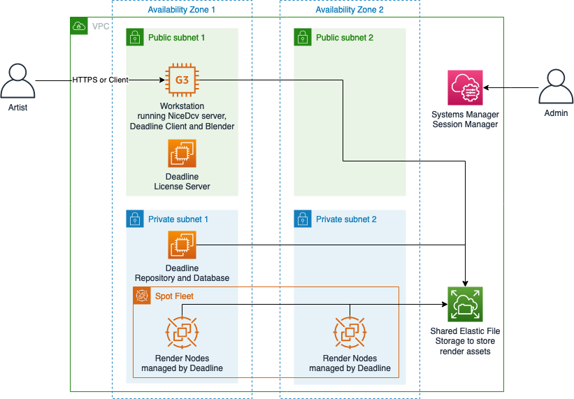

# AWS Digital Content Creation Render Environment

[](https://travis-ci.org/aws-samples/aws-digital-content-creation-render-environment)

This solution deploys an AWS Cloud environment that helps media and entertainment organizations with burst rendering workloads. This CloudFormation template will deploy and setup [AWS ThinkBox Deadline](https://www.awsthinkbox.com/deadline) Database and Repository, Workstation, License Server, and Render nodes.

Furthermore, the solution comes with [Blender](https://www.blender.org/) installation scripts, which is a popular open-source software for 3D modeling, animation, rendering and more...

## Index

- [Architecture](#architecture)
- [Getting Started](#getting-started)
    - [Prerequisites](#prerequisites)
    - [Deployment](#deployment)
    - [Login to Workstation](#login-to-workstation)
- [Set up Blender](#set-up-blender)
    -
    -
- [Render example](#render-example)
    -
    -
- [Running the tests](#running-the-tests)
- [Clean up resources](#clean-up-resources)
- [Contributing](#contributing)

### Architecture

An overview of the architecture:



## Getting Started
TODO
These instructions will get you a copy of the project up and running on your local machine for development and testing purposes. See deployment for notes on how to deploy the project on a live system.

### Prerequisites
TODO
What things you need to install the software and how to install them

```
Give examples
```

### Deployment

The environment is deployed as an [AWS CloudFormation](https://aws.amazon.com/cloudformation) template.

> **Note**
You are responsible for the cost of the AWS services used while running this sample deployment. There is no additional cost for using this sample. For full details, see the pricing pages for each AWS service you will be using in this sample. Prices are subject to change.

1. Deploy the latest CloudFormation template by following the link below for your preferred AWS region:

|Region|Launch Template|
|------|---------------|
|**US East (N. Virginia)** (us-east-1) | [](https://console.aws.amazon.com/cloudformation/home?region=us-east-1#/stacks/new?stackName=aws-digital-content-creation-render-environment&templateURL=https://s3.amazonaws.com/solution-builders-us-east-1/aws-digital-content-creation-render-environment/latest/root.template)|
|**US East (Ohio)** (us-east-2) | [](https://console.aws.amazon.com/cloudformation/home?region=us-east-2#/stacks/new?stackName=aws-digital-content-creation-render-environment&templateURL=https://s3.amazonaws.com/solution-builders-us-east-2/aws-digital-content-creation-render-environment/latest/root.template)|
|**US West (N. California)** (us-west-1) | [](https://console.aws.amazon.com/cloudformation/home?region=us-west-1#/stacks/new?stackName=aws-digital-content-creation-render-environment&templateURL=https://s3.amazonaws.com/solution-builders-us-west-1/aws-digital-content-creation-render-environment/latest/root.template)|
|**US West (Oregon)** (us-west-2) | [](https://console.aws.amazon.com/cloudformation/home?region=us-west-2#/stacks/new?stackName=aws-digital-content-creation-render-environment&templateURL=https://s3.amazonaws.com/solution-builders-us-west-2/aws-digital-content-creation-render-environment/latest/root.template)|
|**Asia Pacific (Tokyo)** (ap-northeast-1) | [](https://console.aws.amazon.com/cloudformation/home?region=ap-northeast-1#/stacks/new?stackName=aws-digital-content-creation-render-environment&templateURL=https://s3.amazonaws.com/solution-builders-ap-northeast-1/aws-digital-content-creation-render-environment/latest/root.template)|
|**Asia Pacific (Seoul)** (ap-northeast-2) | [](https://console.aws.amazon.com/cloudformation/home?region=ap-northeast-2#/stacks/new?stackName=aws-digital-content-creation-render-environment&templateURL=https://s3.amazonaws.com/solution-builders-ap-northeast-2/aws-digital-content-creation-render-environment/latest/root.template)|
|**Asia Pacific (Mumbai)** (ap-south-1) | [](https://console.aws.amazon.com/cloudformation/home?region=ap-south-1#/stacks/new?stackName=aws-digital-content-creation-render-environment&templateURL=https://s3.amazonaws.com/solution-builders-ap-south-1/aws-digital-content-creation-render-environment/latest/root.template)|
|**Asia Pacific (Singapore)** (ap-southeast-1) | [](https://console.aws.amazon.com/cloudformation/home?region=ap-southeast-1#/stacks/new?stackName=aws-digital-content-creation-render-environment&templateURL=https://s3.amazonaws.com/solution-builders-ap-southeast-1/aws-digital-content-creation-render-environment/latest/root.template)|
|**Asia Pacific (Sydney)** (ap-southeast-2) | [](https://console.aws.amazon.com/cloudformation/home?region=ap-southeast-2#/stacks/new?stackName=aws-digital-content-creation-render-environment&templateURL=https://s3.amazonaws.com/solution-builders-ap-southeast-2/aws-digital-content-creation-render-environment/latest/root.template)|
|**EU (Frankfurt)** (eu-central-1) | [](https://console.aws.amazon.com/cloudformation/home?region=eu-central-1#/stacks/new?stackName=aws-digital-content-creation-render-environment&templateURL=https://s3.amazonaws.com/solution-builders-eu-central-1/aws-digital-content-creation-render-environment/latest/root.template)|
|**EU (Ireland)** (eu-west-1) | [](https://console.aws.amazon.com/cloudformation/home?region=eu-west-1#/stacks/new?stackName=aws-digital-content-creation-render-environment&templateURL=https://s3.amazonaws.com/solution-builders-eu-west-1/aws-digital-content-creation-render-environment/latest/root.template)|

2. If prompted, login using your AWS account credentials.
1. You should see a screen titled "*Create Stack*" at the "*Specify template*" step. The fields specifying the CloudFormation template are pre-populated. Click the *Next* button at the bottom of the page.
1. On the "*Specify stack details*" screen you may customize the following parameters of the CloudFormation stack:

### Login to Workstation
TODO
## Set up Blender
TODO
## Render example
TODO

## Running the tests

Explain how to run the automated tests for this system

```
Give an example
```

## Clean up resources

To remove the deployed solution:

1. Open the AWS CloudFormation Console
1. Click the MediaAnalysis project, right-click and select "*Delete Stack*"
1. Your stack will take some time to be deleted. You can track its progress in the "Events" tab.
1. When it is done, the status will change from DELETE_IN_PROGRESS" to "DELETE_COMPLETE". It will then disappear from the list.

When it is done, the status will change from DELETE_IN_PROGRESS" to "DELETE_COMPLETE". It will then disappear from
the list.

## Contributing

Contributions are more than welcome. Please read the [code of conduct](CODE_OF_CONDUCT.md) and the [contributing guidelines](CONTRIBUTING.md).

## Authors

See the list of [contributors](https://github.com/aws-samples/aws-digital-content-creation-render-environment/contributors) who participated in this project.

## License

This library is licensed under the MIT-0 License. See the LICENSE file. - see the [LICENSE](LICENSE) file for details.
