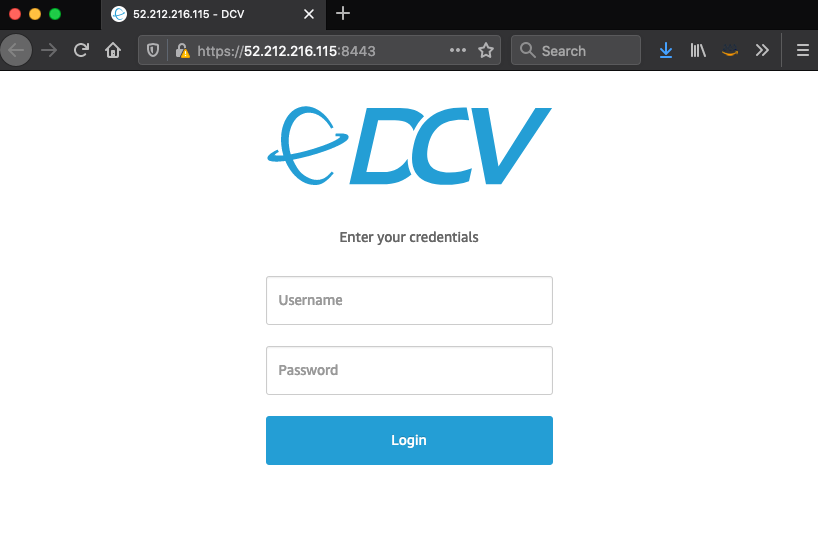

# AWS Digital Content Creation Render Environment

[](https://travis-ci.org/aws-samples/aws-digital-content-creation-render-environment)

This solution deploys an AWS Cloud environment that helps media and entertainment organizations with burst rendering workloads. This CloudFormation template will deploy and setup [AWS ThinkBox Deadline](https://www.awsthinkbox.com/deadline) Database and Repository, Workstation, License Server, and Render nodes.

Furthermore, the solution comes with [Blender](https://www.blender.org/) installation scripts, which is a popular open-source software for 3D modeling, animation, rendering and more...

## Index

- [Architecture](#architecture)
- [Getting Started](#getting-started)
    - [Prerequisites](#prerequisites)
    - [Deployment](#deployment)
    - [Login to Workstation and Start Deadline application](#login-to-workstation-and-start-deadline-application)
- [Render Something to Test the Setup](#render-something-to-test-the-setup)
- [Local Development](#local-development)
- [Running the tests](#running-the-tests)
- [Clean up](#clean-up)
- [Contributing](#contributing)

### Architecture

An overview of the architecture:


## Getting Started

### Prerequisites
1. To deploy the application you will require an AWS account. If you don’t already have an AWS account, create one at <https://aws.amazon.com> by following the on-screen instructions. Your access to the AWS account must have IAM permissions to launch AWS CloudFormation templates that create IAM roles.
2. If deploying an [AWS Client VPN](https://docs.aws.amazon.com/vpn/latest/clientvpn-user/client-vpn-user-what-is.html) endpoint. You must generate a server/client certificate and upload those certificates to [AWS Certificate Manager](https://docs.aws.amazon.com/acm/latest/userguide/acm-overview.html). Click [here](https://docs.aws.amazon.com/vpn/latest/clientvpn-admin/authentication-authorization.html#mutual) to see instructions on how to create server/client certs.

### Deployment

The environment is deployed as an [AWS CloudFormation](https://aws.amazon.com/cloudformation) template.

> **Note**
You are responsible for the cost of the AWS services used while running this sample deployment. There is no additional cost for using this sample. For full details, see the pricing pages for each AWS service you will be using in this sample. Prices are subject to change.

1. Deploy the latest CloudFormation template by following the link below for your preferred AWS region:

   > It will take about 13 minutes for the deployment to finish.

    |Region|Launch Template|
    |------|---------------|
    |**US East (N. Virginia)** (us-east-1) | [](https://console.aws.amazon.com/cloudformation/home?region=us-east-1#/stacks/new?stackName=aws-digital-content-creation-render-environment&templateURL=https://s3.amazonaws.com/solution-builders-us-east-1/aws-digital-content-creation-render-environment/latest/main.template)|
    |**US East (Ohio)** (us-east-2) | [](https://console.aws.amazon.com/cloudformation/home?region=us-east-2#/stacks/new?stackName=aws-digital-content-creation-render-environment&templateURL=https://s3.amazonaws.com/solution-builders-us-east-2/aws-digital-content-creation-render-environment/latest/main.template)|
    |**US West (Oregon)** (us-west-2) | [](https://console.aws.amazon.com/cloudformation/home?region=us-west-2#/stacks/new?stackName=aws-digital-content-creation-render-environment&templateURL=https://s3.amazonaws.com/solution-builders-us-west-2/aws-digital-content-creation-render-environment/latest/main.template)|
    |**Asia Pacific (Tokyo)** (ap-northeast-1) | [](https://console.aws.amazon.com/cloudformation/home?region=ap-northeast-1#/stacks/new?stackName=aws-digital-content-creation-render-environment&templateURL=https://s3.amazonaws.com/solution-builders-ap-northeast-1/aws-digital-content-creation-render-environment/latest/main.template)|
    |**Asia Pacific (Singapore)** (ap-southeast-1) | [](https://console.aws.amazon.com/cloudformation/home?region=ap-southeast-1#/stacks/new?stackName=aws-digital-content-creation-render-environment&templateURL=https://s3.amazonaws.com/solution-builders-ap-southeast-1/aws-digital-content-creation-render-environment/latest/main.template)|
    |**EU (Frankfurt)** (eu-central-1) | [](https://console.aws.amazon.com/cloudformation/home?region=eu-central-1#/stacks/new?stackName=aws-digital-content-creation-render-environment&templateURL=https://s3.amazonaws.com/solution-builders-eu-central-1/aws-digital-content-creation-render-environment/latest/main.template)|
    |**EU (Ireland)** (eu-west-1) | [](https://console.aws.amazon.com/cloudformation/home?region=eu-west-1#/stacks/new?stackName=aws-digital-content-creation-render-environment&templateURL=https://s3.amazonaws.com/solution-builders-eu-west-1/aws-digital-content-creation-render-environment/latest/main.template)|

1. If prompted, login using your AWS account credentials.
1. You should see a screen titled **Create Stack** at the **Specify template** step. The fields specifying the CloudFormation template are pre-populated. Click the **Next** button at the bottom of the page.
1. On the **Specify stack details** screen you may customize the following parameters of the CloudFormation stack:

    |Parameter label|Default|Description|
    |---------------|-------|-----------|
    |Availability Zones | `Requires input` | The list of Availability Zones to use for the subnets in the VPC. Select **two** Availability Zones from your list. |
    |VPC name | dcc-vpc | The name of the VPC. |
    |VPC CIDR | 10.0.0.0/16 | The CIDR block for the production VPC. |
    |Public Subnet 1 CIDR | 10.0.0.0/24 | The CIDR block for the public subnet located in Availability Zone 1 of the VPC. |
    |Public Subnet 2 CIDR | 10.0.1.0/24 | The CIDR block for the public subnet located in Availability Zone 2 of the VPC. |
    |Private Subnet 1 CIDR | 10.0.2.0/24 | The CIDR block for the private subnet located in Availability Zone 1 of the VPC. |
    |Private Subnet 2 CIDR | 10.0.3.0/24 | The CIDR block for the private subnet located in Availability Zone 2 of the VPC. |
    |Render scheduler instance type | m5.2xlarge | The EC2 instance type for the Deadline repository. |
    |Deadline application version | 10.1.3.6 | The version of Deadline application. |
    |License server instance type| m5.large | The EC2 instance type for the License server. |
    |License server version | 1.1 | The version of License server. |
    |Deadline license key | 123456789012 | The Deadline license key. |
    |Workstation instance type | g4dn.xlarge | The EC2 instance type for the Deadline workstation. |
    |Workstation EBS volume size| 100 | Volume size for the VFX Host, in GiB. |
    |Workstation subnet placement | Public | Specify if VFX host should be placed in "Public" or "Private" subnet. |
    |Workstation access CIDR| 10.0.0.0/16 | CIDR block of an on-premise IP address. Input your network's current public or private IP depending if the Workstation is being placed in a public or private subnet. |
    |EC2 user password| `Requires input` | The **ec2-user** password for remote access to NICEDCV workstation server and to access Deadline Repository samba share. |
    |Render node instance type | c5.4xlarge,c4.4xlarge | The EC2 instance type for the Deadline Render node. |
    |Render node capacity | 2 | The number of instances in the Spot Fleet. |
    |ArtefactBucketName | aws-digital-content-creation-render-environment | The S3 bucket you created for your copy of Quick Start assets, if you decide to customize or extend the solution for your own use. |
    |Environment | DEV | The type of environment to tag your infrastructure with. You can specify DEV (development), TEST (test), or PROD (production). |


1. When completed, click **Next**.
1. [Configure stack options](https://docs.aws.amazon.com/AWSCloudFormation/latest/UserGuide/cfn-console-add-tags.html) if desired, then click **Next**.
1. On the **Review** screen, you must check the boxes for:
   * "*I acknowledge that AWS CloudFormation might create IAM resources*"
   * "*I acknowledge that AWS CloudFormation might create IAM resources with custom names*"
   * "*I acknowledge that AWS CloudFormation might require the following capability: CAPABILITY_AUTO_EXPAND*"

   These are required to allow CloudFormation to create a Role to allow access to resources needed by the stack and name the resources in a dynamic way.
1. Click **Create Change Set**.
1. On the **Change Set** screen, click **Execute** to launch your stack.
    > You may need to wait for the *Execution status* of the change set to become **AVAILABLE** before the **Execute** button becomes available.
1. Wait for the CloudFormation stack to launch. Completion is indicated when the **Stack status** is **CREATE_COMPLETE**.
    > You can monitor the stack creation progress in the "Events" tab.

### Login to Workstation and Start Deadline application

1. Note the **WorkstationPublicIP** displayed in the **Outputs** tab of the **root** stack (it is the one without word **NESTED**).
1. On the web browser or in the [NICE DCV Client](https://download.nice-dcv.com/), paste the **WorkstationPublicIP** and log in to the workstation with **ec2-user** credentials.
   

## Render Something to Test the Setup

Now you’ve got most of the pieces together, it’s a good idea to test the setup to make sure you can submit a render from your workstation, have the Render Scheduler pick it up, and run the render on your Worker.

For this part, you will use [Blender](https://www.blender.org/) to render something.

Follow the instructions to:

* set up [Worker Nodes](docs/workers-setup.md)
* set up [Blender and submit a job](docs/blender.md)

## Local Development
See [Local Development](LOCAL_DEVELOPMENT.md) guide to get a copy of the project up and running on your local machine for development and testing purposes.

## Running the tests

The solution has been tested using [taskcat](https://github.com/aws-quickstart/taskcat) the tool that tests AWS CloudFormation templates.

Install taskcat
```
pip install taskcat
```

> You need to package the templates to S3 before you can run the test below. See [Getting Started](#getting-started) instructions.

From within project root directory run:
```
taskat test run
```

You can modify the `taskcat` configuration file with your own tests here [.taskcat.yml](.taskcat.yml)

## Clean up

Follow these steps to clean up created resources:

1. In the **[CloudFormation console](https://console.aws.amazon.com/cloudformation)**, select the the **root** stack you have created. For example `aws-digital-content-creation-render-environment `.
1. The **root** stack will handle the deletion of all the **children** stacks for you.
1. In the top right corner, click on **Delete**.
1. In the pop up window click on **Delete stack**.
1. You can click the **refresh** button a few times until you see in the status **DELETE_COMPLETE**.

## Contributing

Contributions are more than welcome. Please read the [code of conduct](CODE_OF_CONDUCT.md) and the [contributing guidelines](CONTRIBUTING.md).

## Authors

See the list of [contributors](https://github.com/aws-samples/aws-digital-content-creation-render-environment/contributors) who participated in this project.

## License

This library is licensed under the MIT-0 License. See the LICENSE file. - see the [LICENSE](LICENSE) file for details.
