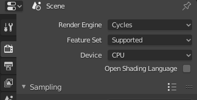
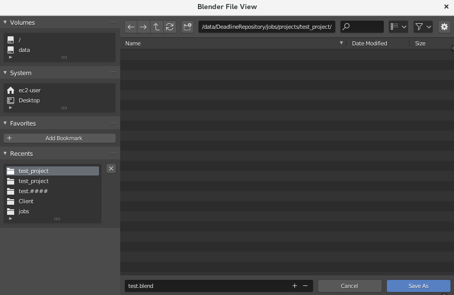
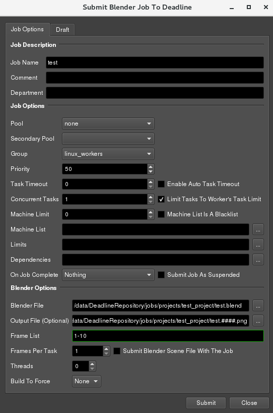
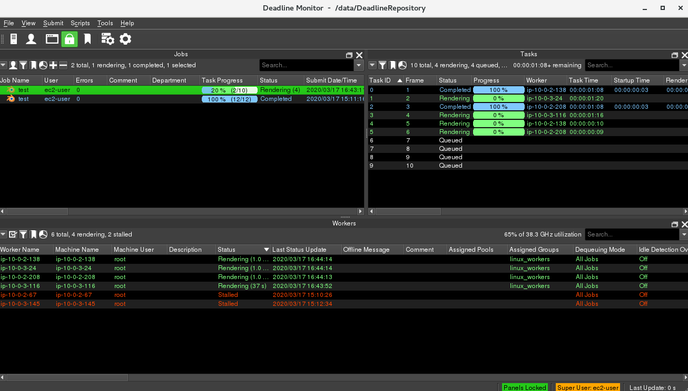

## Set up Blender

This will involve using the workstation to set up a shot to do a test render.

1. Log into your **Workstation** using **ec2-user** user account.
1. Create a `test_project` folder in **projects** directory `/data/DeadlineRepository/jobs/`

   ```
   mkdir -p  /mnt/efs/test_project
   ```

1. Launch **Blender** by running the blender shortcut located in */usr/local/Blender*

   ```
   /usr/local/Blender/blender
   ```

1. The Deadline Blender submitter needs to be re-installed for each user, so you should do that now:
    * Go **Edit → Preferences...**
    * Click on *Add-Ons* in the left panel
    * Click *Install...*
    * Navigate to **/data/DeadlineRepository/submission/Blender/Client/**
    * Choose *DeadlineBlenderClient.py*
    * Click *Install Add-on*
    * Click the checkbox next to *Render: Submit Blender to Deadline* add-on and close the Preferences window

1. For your test render, you can just use the default blender file with a cube and camera (this is just a test to make sure everything is working correctly. If you’d like to make a super fancy file, you’re more than welcome to.)
1. Set your output settings:
    * In the **Properties** Panel on the right, click on **Render Properties** (the icon looks like an old-timey television)
    * For **Render Engine** choose **Cycles**

    

    * Click on *Output Properties* (the icon looks like an inkjet printer).
    * Under *Output* change the value to **//test.####**
    * Now save the file as `test.blend` in `/data/DeadlineRepository/jobs/projects/test_project/`

    

1. Submit your render
    * Choose **Render→Submit to Deadline**
    * Set the **Group** to **linux_workers**
    * Set the **Frame List** to **1-10**
    * Make sure the **Blender File** and **Output File** is set properly.
    * Click **Submit**

    

1. You should see your render going in the **Deadline Monitor**

    

 >Congratulations, you have successfully send a job to render nodes. You can now go back to the main [README](../README.md).
