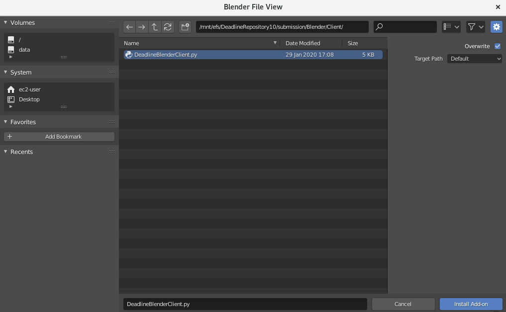
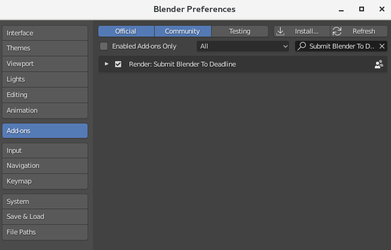
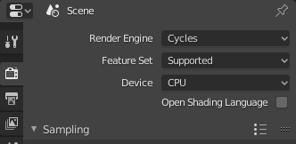
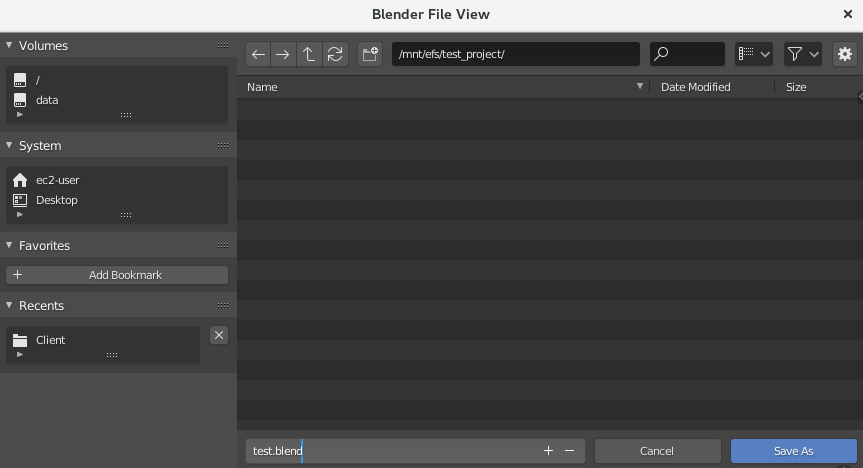
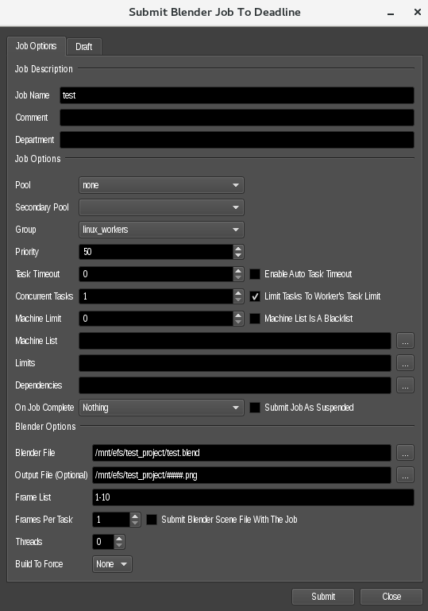
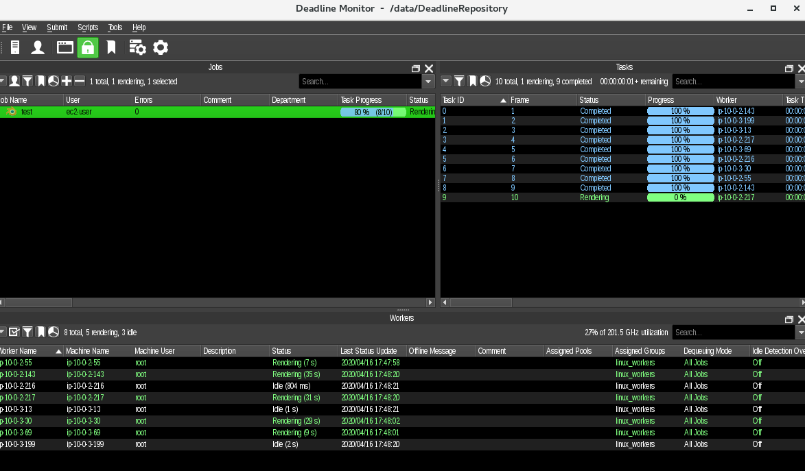
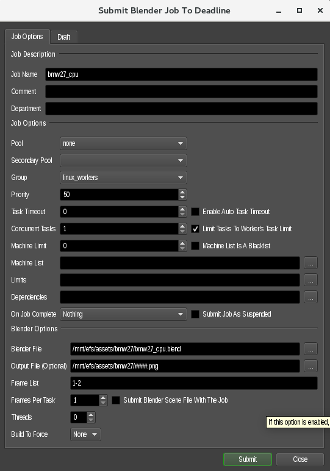
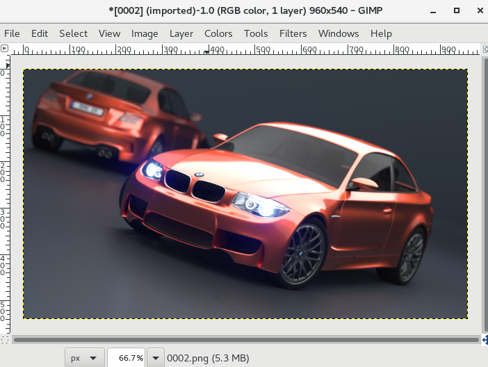

## Set up Blender

This will involve using the workstation to set up a shot to do a test render.

1. Log into your **Workstation** using **ec2-user** user account.
1. Open the terminal and create a `test_project` folder in **projects** directory `/mnt/efs/test_project`

   ```
   mkdir -p  /mnt/efs/test_project
   ```

1. Launch **Blender** by running the blender shortcut located in */usr/local/Blender*

   ```
   /usr/local/Blender/blender
   ```

1. The Deadline Blender submitter needs to be re-installed for each user, so you should do that now:
    * Go to **Edit → Preferences...**
    * Click on **Add-ons** in the left panel
    * Click **Install...**

      

    * Navigate to **/data/DeadlineRepository/submission/Blender/Client/**
    * Choose **DeadlineBlenderClient.py**
    * Click **Install Add-on**

      

    * Click the checkbox next to **Render: Submit Blender to Deadline** add-on and close the Preferences window

      

## Test the Blender set up

1. For your test render, you can just use the default blender file with a cube and camera (this is just a test to make sure everything is working correctly. Later on you will make a super fancy file, using Blender Demo library.)
1. Set your output settings:
    * In the **Properties** Panel on the right, click on **Render Properties** (the icon looks like an old-timey television)
    * For **Render Engine** choose **Cycles**

      

    * Click on **Output Properties** (the icon looks like an ink-jet printer)
    * Under **Output** change the value to **//####.png**

      

    * Now save the file with `Shift Ctrl S` as `test.blend` in `/mnt/efs/test_project/`

      

1. Submit your render
    * Choose **Render → Submit to Deadline**
    * Set the **Group** to **linux_workers**
    * Set the **Frame List** to **1-10**
    * Make sure the **Blender File** and **Output File** is set properly

      

    * Click **Submit** and **Close** the window

1. Go back to Deadline monitor application. You should see your render going in the **Deadline Monitor**

   

## Render something fancy

Now that our rendering farm is set up, let's render something cool. Blender provides ready to render [Demo Files](https://www.blender.org/download/demo-files/), so let's go ahead and use one.

1. The sample file can be found in `/mnt/efs/assets` folder
1. In Blender, go to `File -> Open` and inside **bmw272** folder open the `bmw272.cpu.blend` file
1. Click on **Output Properties** and change the value to `//####.png`
1. Choose **Render -> Submit to Deadline**
1. Set the **Group** to **linux_workers**
1. Change the **Frame List**to **1-2**
1. Make sure the **Blender File** and **Output File** are set properly

   

1. Click **Submit** and **Close** the window
1. Go back to Deadline monitor application. You should see your render going in the **Deadline Monitor**
1. Once the job is finished, **right click** on `Task ID 01 | Frame 2` to view the finished outcome of the render job

   

1. It will take about 4 minutes for the job to finish. Below is the outcome of the popular BMW demo by Mike Pan rendered.

   

 > Congratulations, you have successfully sent a job to render nodes. You can now go back to the main [README](../../README.md).
