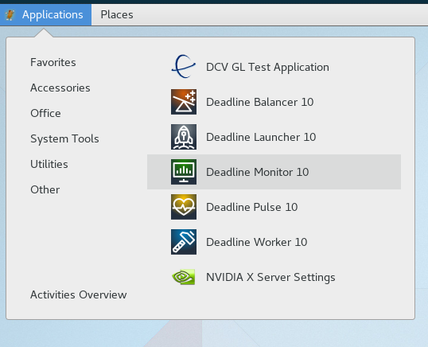
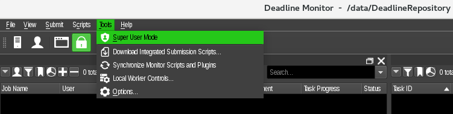
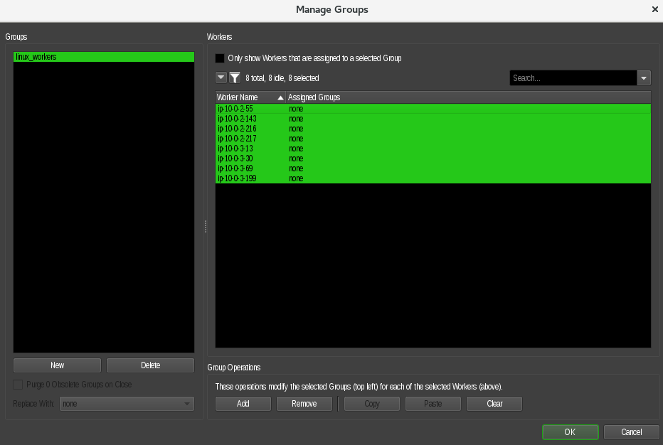

## Set up Deadline render nodes
#### Launch the Monitor

`Applications -> Other -> Deadline Monitor 10`

#### Enable Super User Mode

`Tools -> Super User Mode`

#### Set up the workers group

`Tools -> Manage Groups`

1. Click on **New** to create a group.

1. Give the group name **linux_workers**

    

1. Select all the nodes desired with **CTR+A** and click on **Add**

    

1. Click **Ok**.

Next step is to set up [Blender plug-in](../blender/blender.md).
